# LLM Consultation System

Микросервисная система для взаимодействия с Large Language Models (LLM) через Telegram-бота с JWT-аутентификацией, очередями сообщений и асинхронной обработкой запросов.

---

# Описание проекта

Система реализована в виде двух независимых микросервисов:

## Auth Service

Сервис авторизации, реализованный на FastAPI.

Функциональность:

* регистрация пользователей;
* аутентификация пользователей;
* выдача JWT-токенов;
* получение информации о текущем пользователе;
* защита API через JWT.

Auth Service полностью независим от Telegram и может использоваться любыми внешними клиентами.

---

## Bot Service

Telegram-бот, реализованный на Aiogram.

Функциональность:

* прием сообщений от пользователей Telegram;
* сохранение JWT-токена пользователя;
* проверка валидности JWT;
* отправка запросов в очередь RabbitMQ;
* обработка запросов через Celery Worker;
* взаимодействие с LLM через OpenRouter API;
* хранение временных данных в Redis.

Bot Service не хранит пользователей и не обращается напрямую к базе данных Auth Service.

---

# Архитектура системы

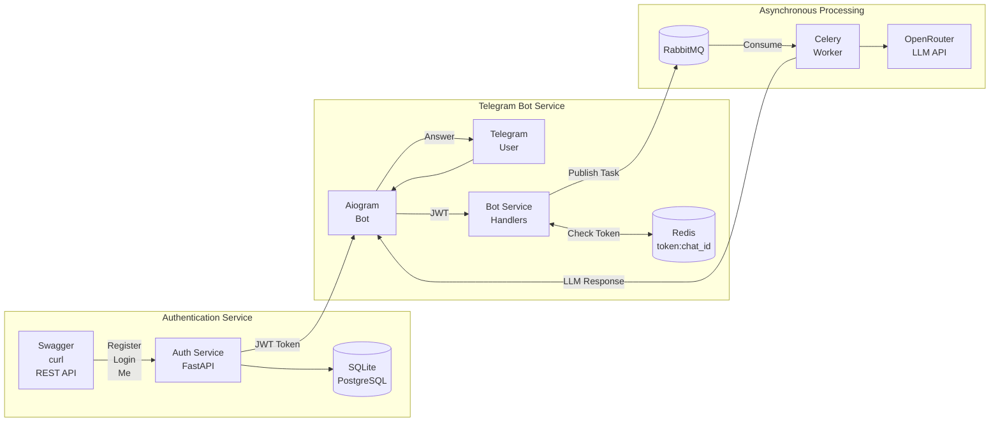

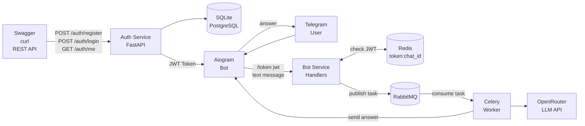

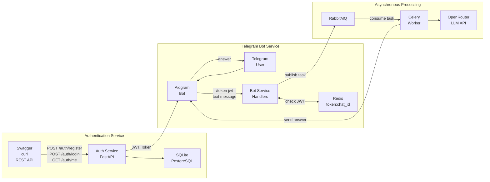


## Преимущества архитектуры

* асинхронная обработка запросов;
* отсутствие блокировки Telegram-бота;
* масштабируемость;
* отказоустойчивость;
* разделение ответственности между сервисами.

---

# Используемые технологии

## Backend

* Python 3.12
* FastAPI
* SQLAlchemy Async
* SQLite
* Pydantic
* Pydantic Settings

## Безопасность

* JWT
* python-jose
* Passlib
* bcrypt

## Telegram

* Aiogram 3

## Очереди и фоновые задачи

* RabbitMQ
* Celery
* Redis

## Контейнеризация

* Docker
* Docker Compose

## Тестирование

* Pytest
* Pytest Asyncio
* HTTPX
* RESPX
* Fakeredis
* Pytest Mock

---

# Структура проекта


```text
llm/
├── auth_service/
│   ├── app/
│   │   ├── api/
│   │   │   ├── deps.py
│   │   │   ├── router.py
│   │   │   └── routes_auth.py
│   │   │
│   │   ├── core/
│   │   │   ├── config.py
│   │   │   ├── exceptions.py
│   │   │   └── security.py
│   │   │
│   │   ├── db/
│   │   │   ├── base.py
│   │   │   ├── models.py
│   │   │   └── session.py
│   │   │
│   │   ├── repositories/
│   │   │   └── users.py
│   │   │
│   │   ├── schemas/
│   │   │   ├── auth.py
│   │   │   └── user.py
│   │   │
│   │   ├── usecases/
│   │   │   └── auth.py
│   │   │
│   │   ├── __init__.py
│   │   └── main.py
│   │
│   ├── tests/
│   │   ├── conftest.py
│   │   ├── test_auth_api.py
│   │   ├── test_auth_negative.py
│   │   └── test_security.py
│   │
│   ├── Dockerfile
│   ├── pyproject.toml
│   ├── pytest.ini
│   └── uv.lock
│
├── bot_service/
│   ├── app/
│   │   ├── api/
│   │   │   └── router.py
│   │   │
│   │   ├── bot/
│   │   │   ├── dispatcher.py
│   │   │   ├── handlers.py
│   │   │   └── run_polling.py
│   │   │
│   │   ├── core/
│   │   │   ├── config.py
│   │   │   └── jwt.py
│   │   │
│   │   ├── infra/
│   │   │   ├── celery_app.py
│   │   │   └── redis.py
│   │   │
│   │   ├── services/
│   │   │   └── openrouter_client.py
│   │   │
│   │   ├── tasks/
│   │   │   └── llm_tasks.py
│   │   │
│   │   ├── __init__.py
│   │   └── main.py
│   │
│   ├── tests/
│   │   ├── test_bot_handlers.py
│   │   ├── test_jwt.py
│   │   └── test_openrouter_client.py
│   │
│   ├── Dockerfile
│   ├── pyproject.toml
│   └── uv.lock
│
├── screenshots/
│   ├── 1_registration.png
│   ├── 2_user_login.png
│   ├── 3_authorizations.png
│   ├── 4_current_user.png
│   ├── 5_Health_Auth_Service.png
│   ├── 6_Bot_LLM.png
│   ├── 7_RabbitMQ-1.png
│   ├── 7_RabbitMQ-2.png
│   ├── 7_RabbitMQ-3.png
│   ├── 8_test_auth_service.png
│   ├── 8_test_bot_service.png
│   └── 9_test_ruff.png
│
├── docker-compose.yml
├── pyproject.toml
└── README.md
```

* Auth Service — сервис аутентификации и авторизации на FastAPI с JWT.
* Bot Service — Telegram-бот на Aiogram для взаимодействия с LLM через OpenRouter.
* RabbitMQ — брокер сообщений для асинхронной обработки запросов.
* Celery — выполнение фоновых задач.
* Redis — хранение токенов и результатов задач.
* Docker Compose — оркестрация всех сервисов проекта.


## Установка и запуск системы. Пользовательский сценарий

### 1. Предварительные требования

Перед началом работы необходимо:

1. Установить и запустить Docker Compose версии 2.0 или выше:

   https://docs.docker.com/compose/install/

2. Получить токен Telegram-бота через @BotFather.

3. Зарегистрироваться на OpenRouter и получить API-ключ:

   https://openrouter.ai

4. Клонировать репозиторий:

```bash
git clone https://github.com/ksenofkv/llm-consultation-system.git
cd llm-consultation-system
```

---

### 2. Настройка переменных окружения

1. Создайте файлы .env (пример приведен в файле .env.example) :
   - `auth_service/.env` 
   - `bot_service/.env` 
  
1. Заполните секреты:
   - `auth_service/.env` — `JWT_SECRET` (общий с ботом).
   - `bot_service/.env` — `TELEGRAM_BOT_TOKEN`, `OPENROUTER_API_KEY`,
     `JWT_SECRET` (тот же, что у Auth Service).

---

### 3. Сборка и запуск сервисов

Соберите и запустите все контейнеры:

```bash
docker compose up -d --build
```
После успешного запуска будут доступны:
* Открыть Swagger UI — http://localhost:8000/docs
* RabbitMQ Management — http://localhost:15672

---

### 4. Регистрация пользователя

Откройте Swagger-интерфейс Auth Service:

```text
http://localhost:8000/docs
```

Выполните запрос:

```http
POST /auth/register
```

Пример тела запроса:

```json
{
  "email": "student_surname@email.com",
  "password": "mypassword"
}
```

где:

* `student_surname` — ваша фамилия латиницей;
* `mypassword` — ваш пароль.

---

### 5. Авторизация

Выполните запрос:

```http
POST /auth/login
```

После успешной авторизации сервис вернет JWT-токен доступа.

---

### 6. Проверка токена

Для проверки токена выполните запрос:

```http
GET /auth/me
```

с использованием полученного JWT-токена.

---

### 7. Подключение Telegram-бота

Откройте Telegram и найдите своего бота.

Отправьте команду:

```text
/start
```

Бот запросит токен доступа.

Отправьте токен командой:

```text
/token <JWT-токен>
```

Например:

```text
/token eyJhbGciOiJIUzI1NiIsInR5cCI6IkpXVCJ9...
```

После успешной проверки токен будет сохранен, и бот предоставит доступ к OpenRouter.

---

### 8. Использование системы

После авторизации можно отправлять боту любые текстовые запросы.

Схема работы системы:

1. Пользователь отправляет сообщение Telegram-боту.
2. Бот проверяет JWT-токен пользователя.
3. Запрос отправляется в очередь RabbitMQ.
4. Celery Worker обрабатывает задачу.
5. OpenRouter генерирует ответ LLM.
6. Ответ возвращается пользователю в Telegram.

---

# Демострация работы

## 1.Swagger: регистрация пользователя

На скриншоте показан запрос POST /auth/register и ответ 201 Created.

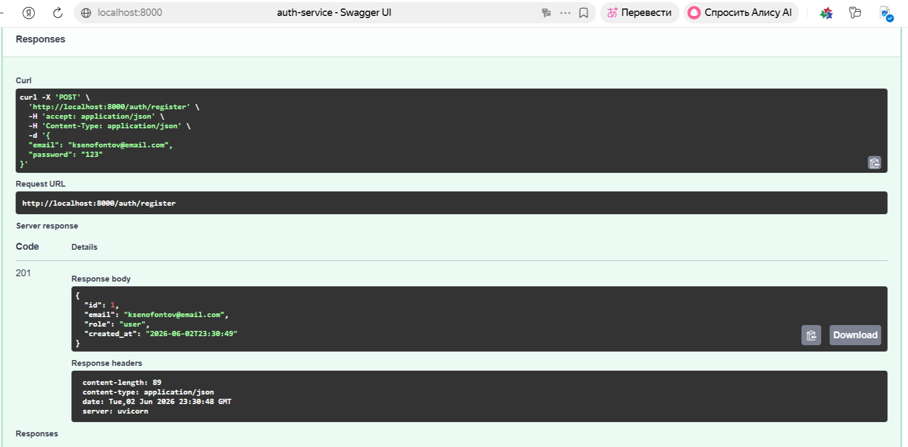

## 2.Swagger: логин пользователя

На скриншоте показан запрос POST /auth/login и получение JWT.

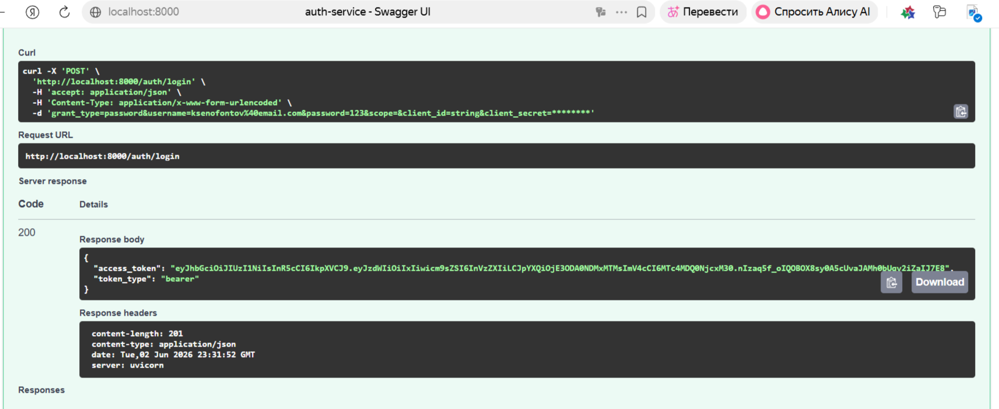

## 3.Swagger authorizations

На скриншоте авторизация в Swagger.

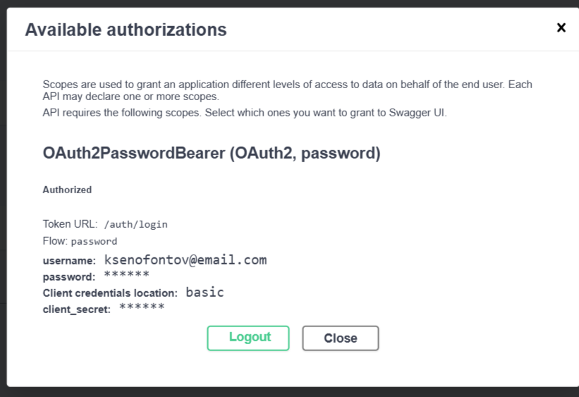

## 4.Swagger: текущий пользователь

На скриншоте показан запрос GET /auth/me по JWT.

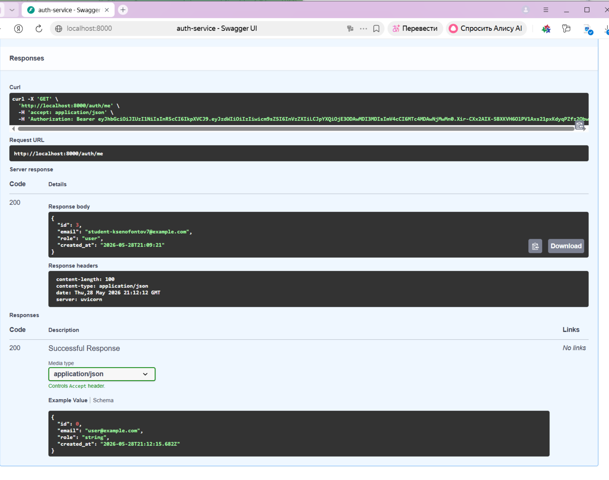

## 5.Swagger: Health Auth Service

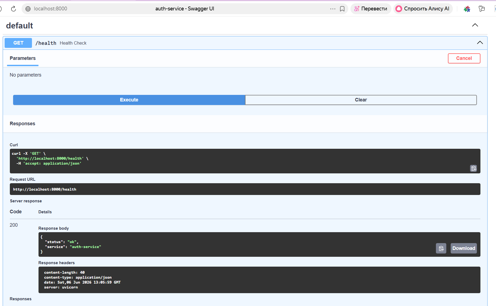

## 6.Telegram-бот

На скриншоте показан диалог с ботом:

- команда /token <jwt>;
- сообщение, что токен сохранён;
- обычный вопрос;
- ответ от LLM. 

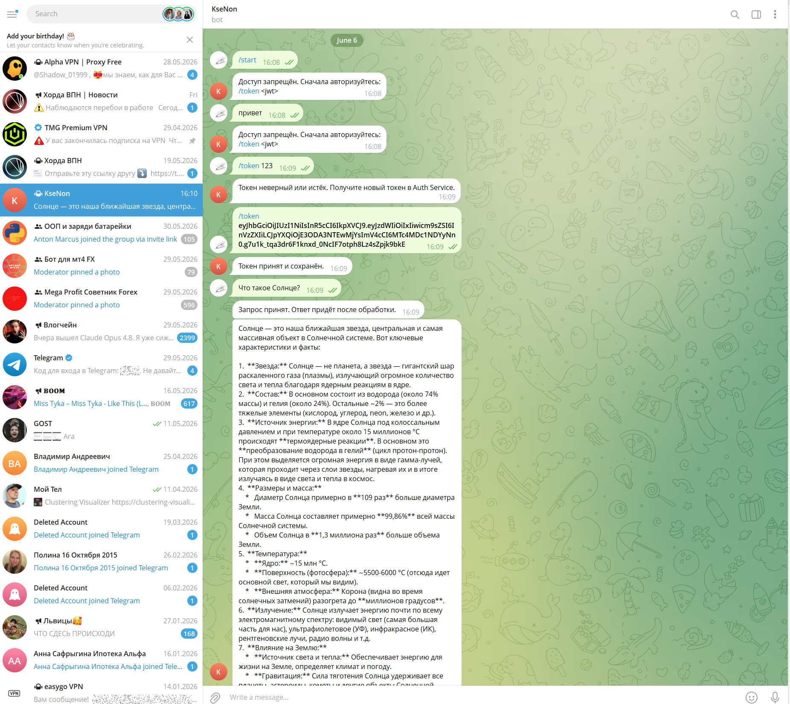

## 7.RabbitMQ

На скриншотах видно, что RabbitMQ запущен и используются очереди Celery.

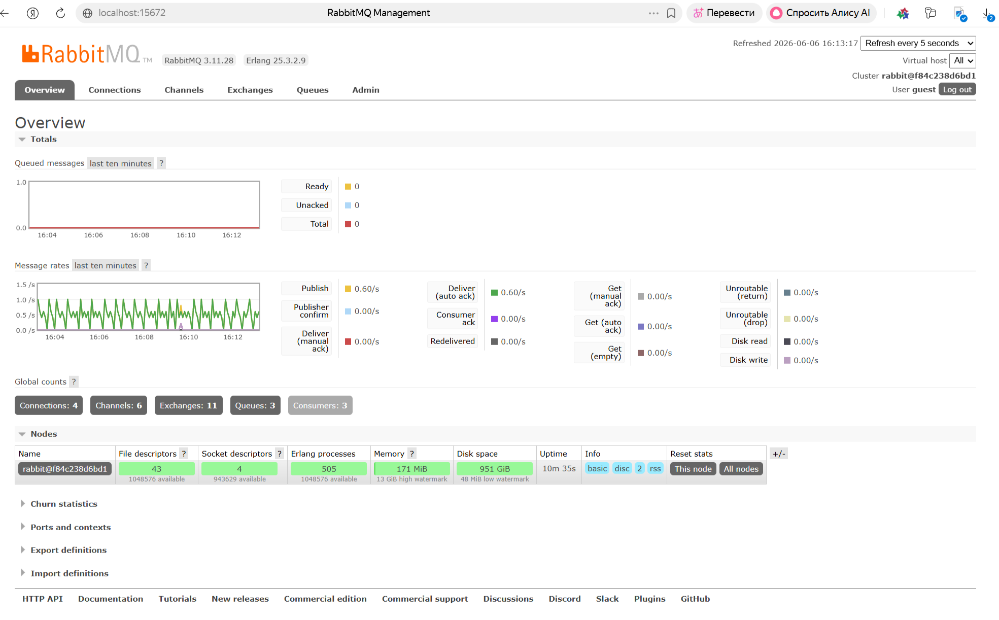

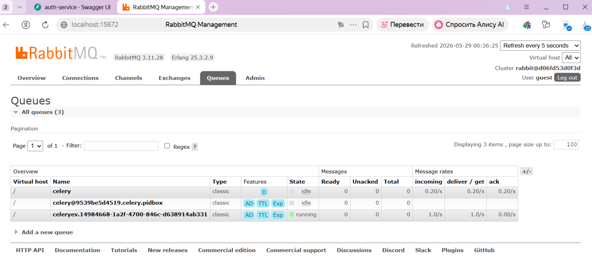

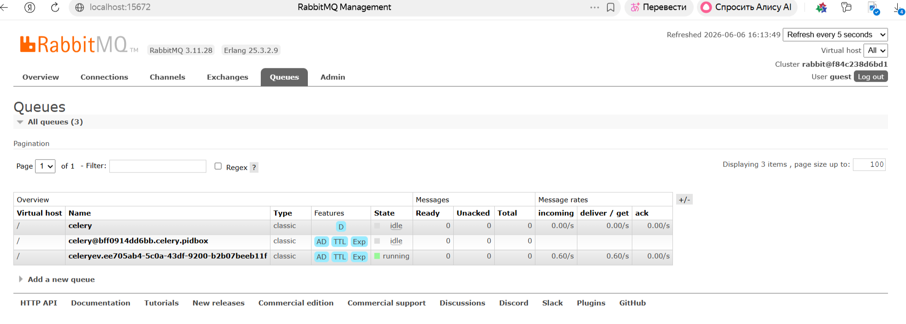

## 8.Тесты

На скриншоте показан успешный запуск тестов.

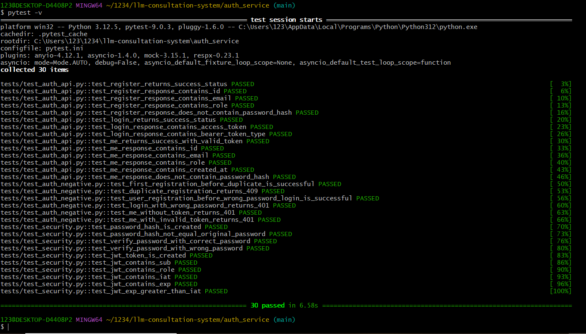

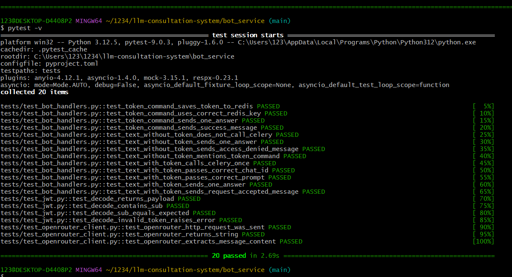

## 8.Ruff

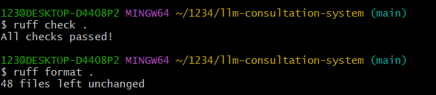


---

# Redis

Redis используется для:

* хранения JWT пользователей;
* хранения промежуточных данных;
* backend-хранилища результатов Celery.

---

# RabbitMQ и Celery

Используются для организации очередей задач и асинхронного взаимодействия между компонентами системы.

Преимущества:

* неблокирующая обработка сообщений;
* масштабируемость;
* распределение нагрузки;
* возможность обработки большого количества запросов.

---

# Тестирование Auth Service

## Запуск тестов

Из директории `auth_service`:

```bash
pytest -v
```

## Реализованные тесты

### Модульные тесты

Проверяют:

* создание хеша пароля;
* отличие хеша от исходного пароля;
* успешную проверку корректного пароля;
* отклонение неверного пароля;
* создание JWT;
* наличие полей `sub`, `role`, `iat`, `exp`.

### Интеграционные тесты

Проверяют:

* регистрацию пользователя;
* авторизацию пользователя;
* получение JWT;
* доступ к `/auth/me`.

### Негативные тесты

Проверяют:

* повторную регистрацию (409);
* неверный пароль (401);
* отсутствие токена (401);
* невалидный токен (401).

---

### Результат

Все тесты успешно пройдены (см. выше скриншот).

# Тестирование Bot Service

## Запуск тестов

Из директории `bot_service`:

```bash
pytest -v
```

## Реализованные тесты

Проверяются следующие компоненты:

### JWT Validation

* корректный JWT;
* истекший JWT;
* невалидный JWT.

### Telegram Handlers

* обработка команды `/start`;
* сохранение JWT через `/token`;
* обработка пользовательских сообщений.

### Redis Integration

* сохранение токенов;
* получение токенов;
* работа через `fakeredis`.

### Celery Integration

* постановка задач в очередь;
* корректный вызов Celery-задач.

### OpenRouter Integration

* успешная обработка HTTP-запросов;
* обработка ошибок внешнего API;
* мокирование через RESPX.

### Результат

Все тесты успешно пройдены (см. выше скриншот).

---

# Дополнительно установленные зависимости для тестирования

## Auth Service

```bash
pip install pytest
pip install pytest-asyncio
pip install httpx
pip install python-multipart
pip install pydantic[email]
pip install python-jose[cryptography]
pip install bcrypt==4.0.1
```

## Bot Service

```bash
pip install pytest pytest-asyncio pytest-mock
pip install fakeredis celery
pip install respx httpx
pip install "python-jose[cryptography]"
```

# Итоги проекта

В рамках проекта была разработана полноценная микросервисная система для взаимодействия с LLM через Telegram.

Реализованы:

* JWT-аутентификация пользователей;
* регистрация и авторизация через FastAPI;
* Telegram-бот на Aiogram;
* асинхронная обработка запросов;
* RabbitMQ + Celery;
* Redis для хранения токенов и промежуточных данных;
* интеграция с OpenRouter API;
* модульное, интеграционное и негативное тестирование;
* контейнеризация через Docker Compose.

# Автор

Ксенофонтов Константин Владимирович (М25-555)


